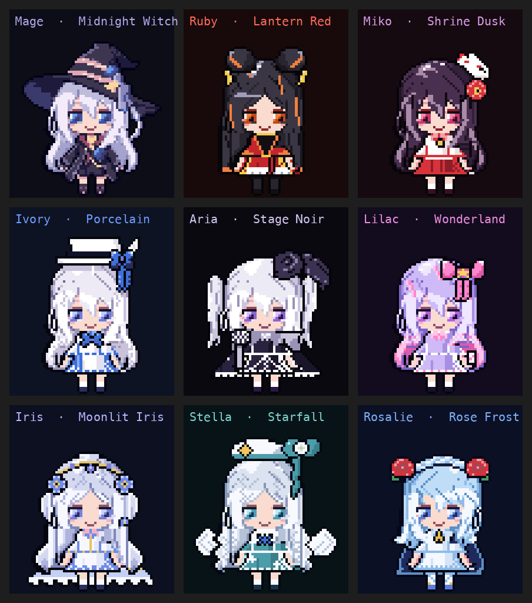

# Chibi Deck

<p align="center">
  
</p>
<p align="center"><sub>Mage on the Midnight Witch theme: the hair-wave loop, and the hop with sparkles when a session needs you</sub></p>

A native macOS menu-bar app that turns the Corsair Xeneon Edge (the 2560×720 touch strip) into an ambient status panel for the Claude Code sessions running on your Mac. Which sessions are running, which one needs you, how much of your limits is left, what time it is, and a pixel-art chibi who reacts to it all. Tap a card to read the last message or send an answer, hold it for a menu, tap the mascot to switch themes.

Everything is read from files Claude Code already writes and from `claude agents --json`. No server, no browser, no network access, nothing written under `~/.claude`.

## What is on the panel

| Column | Content |
|---|---|
| Left (400 px) | Mascot, clock, date. Permission warnings appear here while something is denied. |
| Middle (520 px) | Five-hour, weekly and model-scoped limits from Claude Code's own usage cache, a forecast of when each fills, today's messages / tool calls / cost, and a 24 h tokens-per-hour burn chart built from your transcripts. |
| Right (1640 px) | Up to eight session cards: status and elapsed time, session name, `repo@branch`, your last line and Claude's, the task list, the context-window bar, model and effort chips, and a one-tap answer pill. Waiting sessions get a yellow border, blocked background agents a red one. |

The mascot loops her hair-wave animation the whole time; when a session is waiting for you she hops with sparkles until you answer.

Touch (or the mouse in the preview window):

- **Tap a card** opens the detail sheet: Claude's last text, paged with ▲ ▼, the answers row, Focus tab, Handoff, Dismiss, Hide.
- **Tap the answer pill** types that answer into the session's Terminal tab. Numbered options come from the question Claude asked; otherwise your quick replies (`go`, `yes`, `no` by default).
- **Hold a card for half a second** opens the card menu: Focus tab · Handoff · Dismiss · Hide.
- **Handoff** (card menu or the sheet) makes the session write a handoff prompt with the `/handoff` skill, clears the session with `/clear`, and pastes the prompt back into the same tab, so you come back to a fresh session that already knows where it was. Toasts report each step; the tab must be idle or busy, not waiting on a question.
- **Tap the mascot** switches to the next character and colour theme. **Hold it** for the character-select screen: every character on its own colours, the current one marked; tap one to pick it, tap outside (or wait ten seconds) to close.

## Compatibility

| | Requirement | Notes |
|---|---|---|
| macOS | 15 Sequoia or later, Apple Silicon | Developed on macOS 26 with Xcode 26.6 / Swift 6.3.3 on an M3 Pro. Intel Macs are untested. |
| Display | Corsair Xeneon Edge at 2560×720 | USB-C or HDMI. macOS may first drive the Edge at 1920×1080; pick 2560×720 under System Settings → Displays → Show all resolutions. iCUE is not needed (iCUE for Mac does not support the Edge). Without an Edge the app shows the same panel in a resizable preview window. |
| Touch | Input Monitoring permission | macOS only ever sees the Edge's single-touch mouse interface (USB vendor `0x27C0`, product `0x0859`); the app seizes it through IOHIDManager so taps stop moving your cursor. Multitouch gestures are not possible on macOS. |
| Claude Code | CLI at `~/.local/bin/claude`, `/opt/homebrew/bin/claude` or `/usr/local/bin/claude` | Uses `claude agents --json`, `~/.claude/sessions`, `~/.claude.json`, `~/.claude/stats-cache.json`, `~/.claude/tasks`, `~/.claude/jobs` and the transcripts under `~/.claude/projects`. Verified with Claude Code 2.1.261 to 2.1.263; these formats belong to Claude Code and may change. |
| Terminal | Terminal.app, Automation permission | Focus tab and typed answers drive Terminal.app by AppleScript. Sessions running in other terminals still show on the panel; those two actions do not reach them. |
| Statusline feed (optional) | `jq`, a `statusLine.command` in `~/.claude/settings.json` that runs a `.sh` script containing `input=$(cat)` | The installer adds one marked line to that script so each statusline payload is mirrored to the app's own folder. This feed is where context-window size, per-session cost and live rate limits come from. |
| Mascot tooling (optional) | Python 3.12+, Pillow for review images | Only needed to change or add characters, or to rebuild the app icon (`Scripts/icon/make-icon.py`). |

## Install

From a clone, one line builds the app, installs it under `~/Applications`, starts it, and keeps it starting at login:

```bash
git clone https://github.com/vichannnnn/ChibiDeck.git && cd ChibiDeck && Scripts/install.sh --statusline --skills
```

That needs Xcode 26 (Swift 6.3) on macOS 15 or later. The Command Line Tools alone build the app too, but the macOS 26 app icon is compiled with `actool`, which ships only with the full Xcode; without it `Scripts/bundle.sh` prints a warning, the app keeps the plain `.icns`, and macOS 26 shows it shrunk on a grey tile. The two flags are optional: `--statusline` runs the feed installer (it prints the one line it wants to add to your statusline script and asks first), `--skills` copies the repo's Claude Code skills into `~/.claude/skills` (see [Claude Code skills](#claude-code-skills)). `Scripts/install.sh --uninstall` removes the app and its LaunchAgent; `Scripts/install-statusline.sh --uninstall` reverses the feed hook.

The install signs the app ad-hoc, so macOS treats every rebuild as a new app and asks for its two permissions again. To keep the Input Monitoring and Automation grants across rebuilds, sign with the same Apple Development identity every time (`security find-identity -v -p codesigning` lists yours):

```bash
IDENTITY="Apple Development: you@example.com (TEAMID)" Scripts/install.sh --build
```

Without Xcode, download `ChibiDeck-<version>.zip` from the [releases page](https://github.com/vichannnnn/ChibiDeck/releases), unzip it and drag `Chibi Deck.app` into your Applications folder. The build is signed ad-hoc, not notarised, so on the first open macOS says the app "cannot be verified": right-click the app, choose **Open**, and confirm once. Or clear the quarantine flag in a terminal:

```bash
xattr -dr com.apple.quarantine "/Applications/Chibi Deck.app"
```

To start the zip's copy at login, add it under System Settings → General → Login Items.

Either way, Chibi Deck runs as a menu-bar item (its icon at the top right of the screen) and, by default, as a Dock icon too, so you can keep it in the Dock; clicking the Dock icon opens the preview window. Untick **Show in Dock** in the menu to hide it again. Its menu shows the two permissions it needs and opens the right System Settings pane for each: **Input Monitoring** for touch on the Edge, and **Automation → Terminal** for the tap actions. Plugging the Edge in or out while it runs moves the panel between the Edge and the preview window.

## Build and run

```bash
swift run ChibiDeck        # debug binary as a menu-bar item; stops when you close the terminal
Scripts/bundle.sh          # release build → "build/Chibi Deck.app" and build/ChibiDeck-<version>.zip (IDENTITY, VERSION env vars)
Scripts/install.sh         # copies build/ to ~/Applications, writes the LaunchAgent me.himaa.chibideck, starts the app
```

`swift run` builds a debug binary and starts it as a menu-bar item (there is no main window). With the Edge attached and set to 2560×720 the panel appears on it; with no Edge attached the same panel opens in a preview window on the main screen. The first launch asks for Input Monitoring; the menu shows the state of that permission and of Terminal automation, and offers to open the right System Settings pane. `Scripts/install.sh` builds the bundle itself when `build/` has none; `--build` forces a rebuild, `--dry-run` only prints what it would do.

## Claude Code skills

The repo ships two skills under `.claude/skills/`, so a clone is a complete kit:

| Skill | What it is for |
|---|---|
| `handoff` | Writes a handoff prompt for the next session. The panel's **Handoff** action (card menu and detail sheet) types `/handoff` into the session, so the session must have this skill. |
| `chibi-creation` | How to add or change a mascot with the sprite rig: recipe module, theme, build, review sheet, tests. |

Project skills only apply to Claude Code sessions started inside the clone. `Scripts/install.sh --skills` copies both into `~/.claude/skills`, where every session finds them; a name that already exists there is left alone.

## Settings

All settings are `UserDefaults` under the bundle id; change them with `defaults write me.himaa.chibideck <key> <value>` and relaunch.

| Key | Default | Meaning |
|---|---|---|
| `themeId` | `midnight-witch` | Current mascot and colour theme (tapping the mascot changes it too). |
| `quickReplies` | `go,yes,no` | Comma-separated answers offered when a session is waiting without numbered options. |
| `autoDimEnabled`, `autoDimMinutes` | `false`, `10` | Dim the panel after that many minutes without a touch or a state change. |
| `sheetTimeoutSeconds` | `30` | The detail sheet closes itself after this long. |
| `quietHoursEnabled`, `quietHoursStart`, `quietHoursEnd` | `false`, `22:00`, `07:00` | The mascot sleeps during quiet hours. |
| `touchOffsetX`, `touchOffsetY`, `touchScaleX`, `touchScaleY` | `0`, `0`, `1`, `1` | Touch calibration; every tap logs raw and canvas coordinates so these can be set by hand. |
| `previewAlwaysOpen` | `false` | Keep the preview window open even when the Edge is attached. |
| `showInDock` | `true` | Show a Dock icon (so the app can be kept in the Dock); clicking it opens the preview window. Also in the menu. |
| `backgroundAgentMaxAgeHours` | `24` | Background agents whose job file is older than this drop off the panel. |

Logs go to the unified log: `/usr/bin/log stream --predicate 'subsystem == "me.himaa.chibideck"' --style compact --info`.

## Mascots and themes

Each character comes with its own colour theme; tapping the mascot cycles through them, and holding it opens the character-select screen. The sprites are 68×67 pixels in at most 16 colours, two animations of eight frames at 4 fps: the hair-wave loop, and the "needs you" hop with sparkles. They are generated, not hand-edited: `Scripts/mascots/build.py` composes each character from a shared body, a donor hair cut, hand-drawn accessory grids and a colour table. `Scripts/mascots/README.md` explains how to add one, and the `chibi-creation` skill walks a Claude Code session through it.



Tap order: Mage (Midnight Witch), Ruby (Lantern Red), Miko (Shrine Dusk), Ivory (Porcelain), Aria (Stage Noir), Lilac (Wonderland), Iris (Moonlit Iris), Stella (Starfall), Rosalie (Rose Frost).

## Development

```bash
swift test                                                       # PanelCore unit tests (swift-testing)
swift test --filter TouchTests                                   # one suite
Scripts/test-install-statusline.sh                               # the feed installer against a throwaway HOME
python3 -m unittest discover -s Scripts/mascots -p 'test_*.py'   # the sprite rig
python3 Scripts/mascots/build.py check                           # checked-in sprites match their recipes
```

The code is split into `PanelCore` (pure logic: models, parsers, touch recognisers, state building; no AppKit, fully tested) and the `ChibiDeck` executable (windows, timers, FSEvents, HID, AppleScript). `CLAUDE.md` has the map.

## Privacy

The app only reads. Its one writable location is `~/Library/Application Support/ChibiDeck/` (the transcript index for the burn chart and the statusline feed files). It never edits your statusline script itself; the installer does that once, with your confirmation, and can undo it.

## Upgrading from CorsairDisplay

ChibiDeck was called CorsairDisplay until 2026-09-08. `Scripts/install.sh` retires the old LaunchAgent and app copy, the first launch moves `Application Support/CorsairDisplay` and the old settings over, and `Scripts/install-statusline.sh` replaces the old hook line in your statusline script. macOS keys the Input Monitoring and Automation grants to the bundle id, so it asks for both again.
